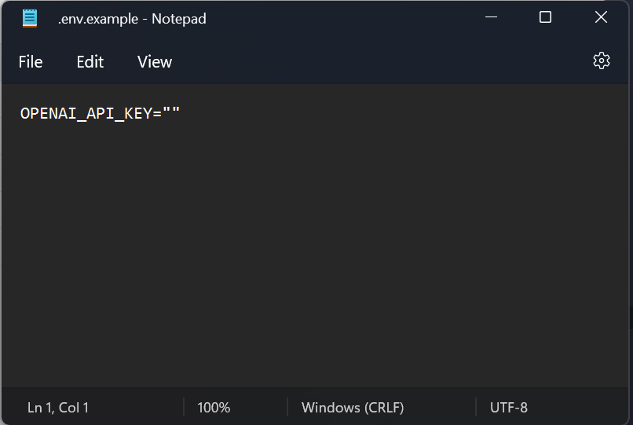

# Voice Assistant Prototype on Jupyter Notebook
Đây chỉ là project thử nghiệm, gồm 2 phần:

- Voice assistant sử dụng các thư viện có sẵn của Python
- Voice assistant sử dụng *ChatGPT* với giọng đọc *chị Google*

---

## Cài đặt

Để thuận tiện cho việc chạy nhiều project cùng lúc, mình có cài đặt môi trường ảo cho jupyter. Nếu máy bạn không có quá nhiều project thì bỏ qua bước cài môi trường ảo cũng được.

### 1. Môi trường ảo
Clone project này về máy:

```bash
git clone https://github.com/hoang97/voice_assistant_jupyter
```

Cài đặt Python Virtual environment:

```bash
cd voice_assistant_jupyter
python3 -m venv env
./env/Scripts/active
```

Cài đặt và Khởi chạy Jupyter Notebook từ môi trường ảo:

```bash
pip install notebook
jupyter notebook
```

***Lưu ý***: đừng tắt terminal sau khi khởi chạy Notebook.

Sau khi khởi chạy thành công, cửa sổ Jupyter sẽ pop-up trên browser. Chọn file setup_env và ấn Run All:

<div align="center">
  
</div>

<div align="center">
  <i>Pic. 1 - Run setup_env file</i>
</div>

Tiếp đến mở file assistant_proj và đổi sang kernel *env*:

<div align="center">
  
</div>

<div align="center">
  <i>Pic. 2 - Run assistant_proj file</i>
</div>

### 2. Khởi tạo biến môi trường
Để có thể sử dụng ChatGPT cần có `API Key` của openai. Sửa tên file `.env.example` thành `.env`, sau đó mở file và điền `API Key` vào đó:

<div align="center">
  
</div>

<div align="center">
  <i>Pic. 3 - Initiate API Key</i>
</div>

***Lưu ý***: Nếu bạn chỉ muốn sử dụng Basic Assistant thì không cần bước này. 

### 3. Khởi chạy Assistant
Đến bước này mọi việc đơn giản chỉ là mở file `assistant_proj` và ấn `Run All` thôi.

Mặc định sẽ chạy `ChatGPT assistant`. Để trải nghiệm `Basic assisstant` bỏ dấu `#` ở dòng dưới:

<div align="center">
  
</div>

<div align="center">
  <i>Pic. 4 - Basic assistant</i>
</div>